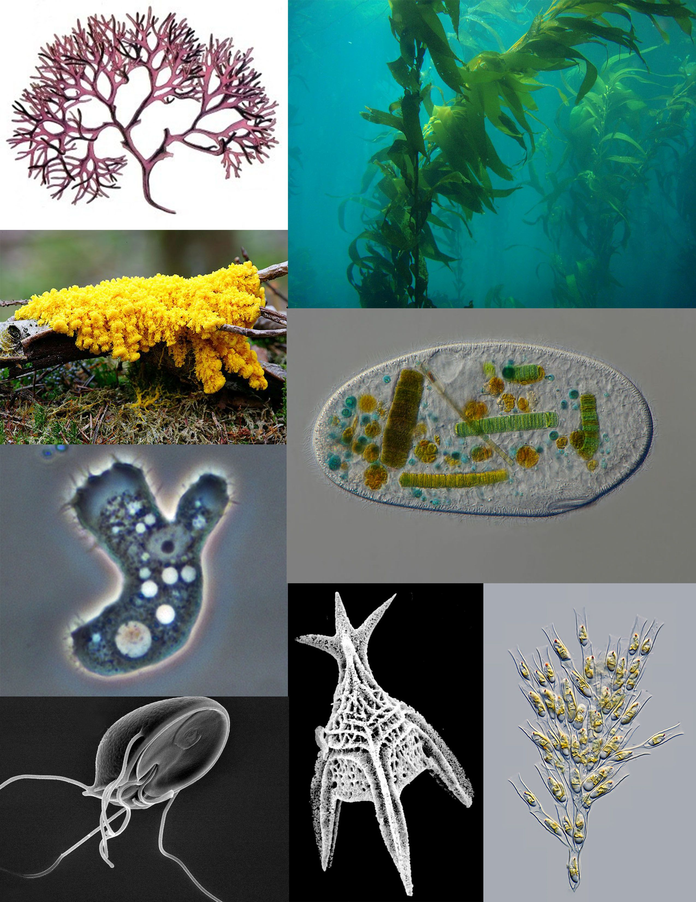
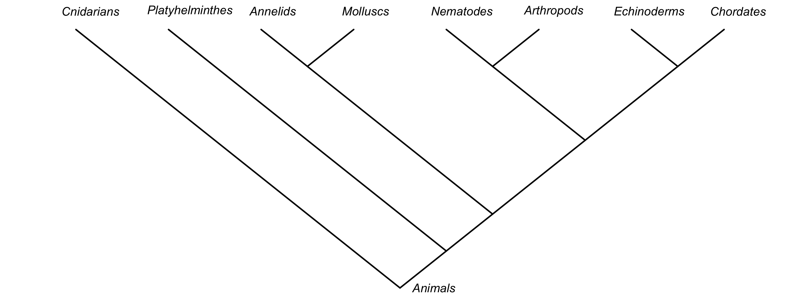

<!-- TODO: "diversity of life" collage -->

# The Tree of Life

- Discovering all its branches
- Understanding how those branches link together/where they are

# Why study life's diversity?

- For its own sake
- For the benefit of society
- For medicines, materials & food

# Taxonomy

> The science of **classifying** & **naming** living organisms

- Foundation of all other life sciences
- Can't get much done if you don't know what something is...

# Old-timey taxonomy: Linnaeus

- Pre-evolutionary views
- Classification based on sexual parts
- A lot of Linnaeus' _Systema Naturae_ & _Systema Plantarum_ didn't hold up to modern scientific evidence...

# Old-timey taxonomy: Linnaeus cont.

But, he gave us 2x amazing (& simple!) things:

- Hierarchical classification
- Binomial nomenclature

# Naming things: Nomenclature

# Classifying things: Hierarchies

- (Domain)
- Kingdom
- Phylum
- Class
- Order
- Family
- Genus
- Species

# The domains

# Proakryotes (simple life)

# Proakryotes (simple life) cont.

# Eukaryotes (having a "true cell nucleus")

![The Kingdoms^[Protists are mostly algal micro-organisms that are neither plants, fungi nor animals] of eukaryotic life](trees/kingdoms.png)

# Protists: the "dust-bin" kingdom

# Fungi: $\frac{1}{2}$ animal & $\frac{1}{2}$ plant

# Animals---both big & small

# Animal phyla

<!-- TODO: cont. -->

# Plants

# Major plant groups

<!-- TODO: cont. -->
