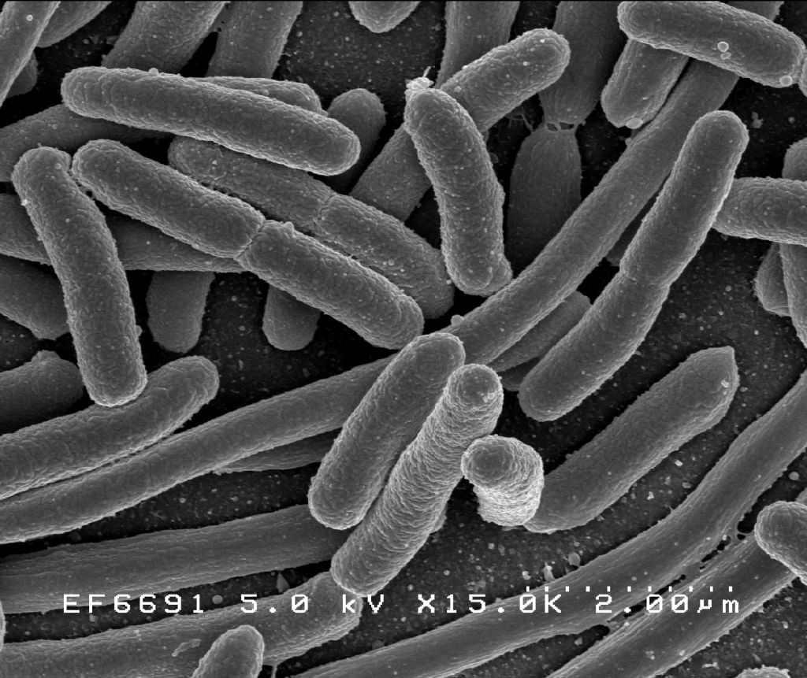

{ width="5cm" }

# The Tree of Life

- Discovering all its branches
- Understanding how those branches link together

# Why study life's diversity?

- For its own sake
- For the benefit of society
- For medicines, materials & food

# Taxonomy

> The science of **classifying** & **naming** organisms

- Foundation of all other life sciences
- Can't do much without knowing what something is...

# Old-timey taxonomy: Linnaeus

{ width="5cm" }

# Old-timey taxonomy: Linnaeus cont.

- Pre-evolutionary
- Classification based on sexual parts for plants ($\checkmark$)
- A lot of Linnaeus' _Systema Naturae_ & _Systema Plantarum_ didn't hold up to modern scientific evidence...

***

But, he gave us 2x amazing (& simple!) things:

- Hierarchical classification
- Binomial nomenclature

# Naming things: Nomenclature

- A unique name for every species
- Common-names led to confusion... 

***

{ width="5cm" }

***

\center

_Plantago foliis ovato-lanceolatus pubescentibus, spica cylindrica, scapo tereti_

(= "plantain with pubescent ovate-lanceolate leaves, a cylindrical spike and a terete scape")

\pause

$\rightarrow$

_Plantago media_

***

{ width="8cm" }

# Classifying things: Hierarchies

# The domains

# Proakryotes (simple life)

{ width="8cm" }

# Proakryotes (simple life) cont.

# Eukaryotes (having a "true cell nucleus")

![The Kingdoms^[Protists are mostly algal micro-organisms that are neither plants, fungi nor animals] of eukaryotic life](trees/kingdoms.png)

# Kingdom Protista

{ width="5cm" }

# Kingdom Fungi

{ width="6cm" }

# Kingdom \textcolor{red}{Animalia}

{ width="4cm" }

# \textcolor{red}{Animal} phyla

> A range of **body-plans** among animals

> More-or-less **increasing complexity**

- Porifera
- Cnidaria
- Platyhelminthes
- Annelida
- Mollusca
- Nematoda
- Arthropoda
- Echinodermata
- Chordata

# Phylum Porifera

- Sea-sponges
- Colonial vs true organism?

# Phylum Cnidaria

Unique stinging cells "cnidocytes"!

{ width="5cm"}
\hfill
{ width="5cm" }

***

***

{ width="8cm" }

# Phylum Platyhelminthes

- Flatworms
- Some parasitic

{ width="7cm" }

# Phylum Annelida

- Worms II: the Sequel
- Segmented-worms

{ width="5cm" }

# Phylum Mollusca

- All have a "mantel", often in a shell
- Some of the most intelligent invertabrates!

{width="3cm" }
\hfill
{ width="3cm" }
\hfill
{ width="3cm" }

# Phylum Nematoda

- Worms III: the Revenge
- Roundwords
- Found _everywhere_
- Taxonomically challenging...

{ width="4cm" }

# Phylum Arthropoda

- "Jointed legs"
- Incredibly diverse

{ width="2.5cm" }
\hfill
{ width="3.5cm" }
\hfill
{ width="2.5cm" }

# Phylum Echinodermata

- Sea-stars & sea-cucumbers
- Five-way symmetry

{ width="5cm" }
\hfill
{ width="5cm" }

# Phylum Chordata

{ width="5cm" }

***

# Kingdom \textcolor{green}{Plantae}

{ width="5cm" }

# Major plant groups

***

\center

Over to Dunja...

Thank you!
